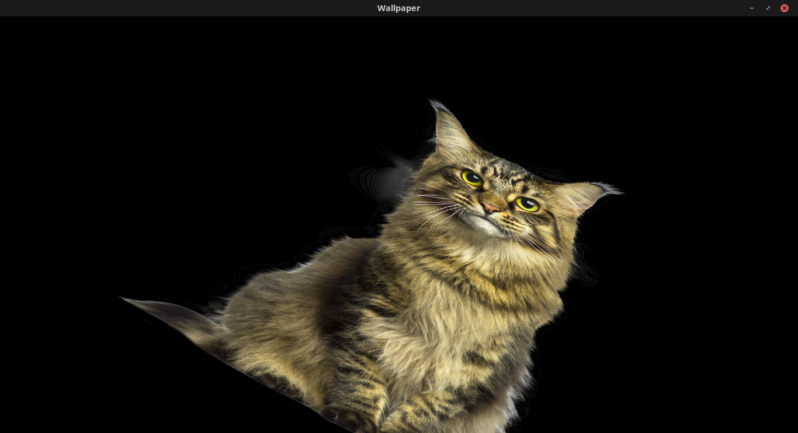
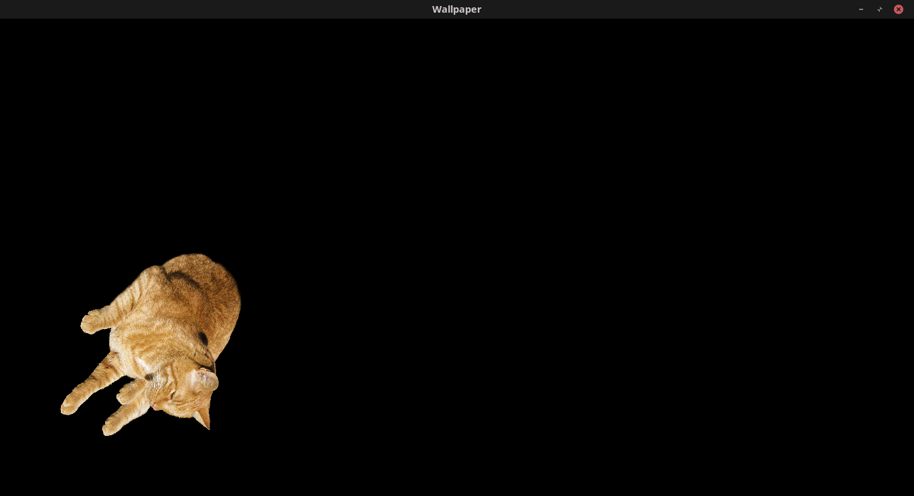

# Projeto Gato Interativo com C++ e SFML

Este projeto é uma aplicação divertida desenvolvida em C++ utilizando a biblioteca SFML (Simple and Fast Multimedia Library). O objetivo é criar um jogo interativo onde um gato muda de imagem ao colidir com as bordas da tela e pode ser controlado pelo usuário para girar e alterar a escala.

## Funcionalidades

**Mudança de imagem**: O gato muda para uma nova imagem ao bater na borda da tela.

**Controles do usuário**:
- **Pressionar `W`**: Aumenta a escala do gato.
- **Pressionar `S`**: Diminui a escala do gato.
- **Pressionar `A`**: Gira o gato para a esquerda.
- **Pressionar `D`**: Gira o gato para a direita.
  
## Prints

